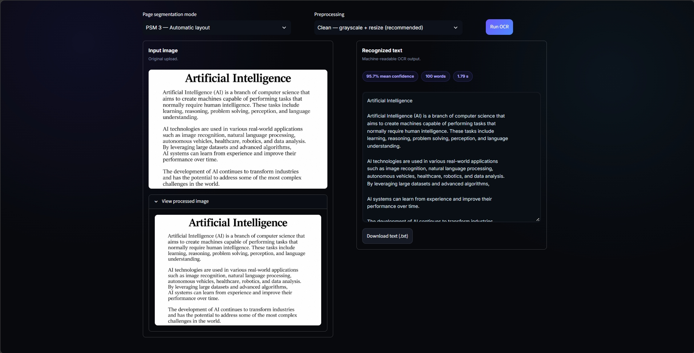
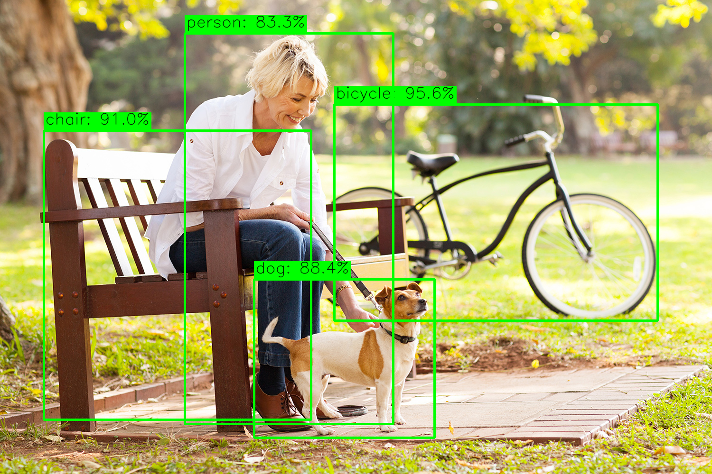

# Visora — Computer Vision Workspace

Visora is a Streamlit web app that puts two computer vision engines in one interface:

- **Text recognition (OCR):** extract text from images with Tesseract.
- **Object detection:** identify everyday objects with a pre-trained MobileNet-SSD model.

## Features

- Upload JPG or PNG images and run either engine from a tabbed workspace
- **OCR:** selectable page segmentation mode (PSM 3, 6, 7, 11) and preprocessing (Clean, Otsu, Adaptive)
- **OCR results:** mean word confidence, word count, processing time, and a `.txt` download
- **Detection:** adjustable confidence threshold (30–95%, default 80%)
- **Detection results:** bounding boxes, a per-object confidence list, inference time, and a `.png` download of the annotated image
- Dark, responsive UI with a side-by-side input and result layout

## Tech stack

| Component | Technology |
|---|---|
| Interface | Streamlit |
| Image processing | OpenCV, Pillow, NumPy |
| Text recognition | Tesseract OCR via `pytesseract` |
| Object detection | MobileNet-SSD (Caffe, Pascal VOC) via OpenCV DNN |

## Project structure

```text
AI-Project-4/
├── app.py                  # Streamlit UI
├── requirements.txt
├── .gitignore
├── .streamlit/
│   └── config.toml         # Theme and toolbar settings
├── modules/
│   ├── preprocessing.py    # Image preparation for OCR
│   ├── ocr.py              # Tesseract wrapper
│   └── object_detection.py # MobileNet-SSD inference and drawing
├── models/                 # MobileNet-SSD .prototxt and .caffemodel
├── input/                  # Sample images
├── output/                 # Sample results
│   ├── ocr/
│   └── detection/
└── test_detection.py       # Standalone detection test
```

## Getting started

### 1. Prerequisites

- Python 3.10 or newer (developed on 3.13)
- **Tesseract OCR**
  - Windows: install it from the UB Mannheim Tesseract builds and keep the default install folder
  - Linux: `sudo apt install tesseract-ocr`
  - macOS: `brew install tesseract`

### 2. Install

```bash
python -m venv venv
venv\Scripts\activate        # Windows
# source venv/bin/activate   # macOS / Linux

pip install -r requirements.txt
```

### 3. Add the model files

Place the MobileNet-SSD (Pascal VOC) Caffe files in the `models/` folder:

- `MobileNetSSD_deploy.prototxt`
- `mobilenet_iter_73000.caffemodel`

These are the widely used files from the `chuanqi305/MobileNet-SSD` repository on GitHub. The app finds them by extension, so the exact filenames don't matter.

### 4. Run

```bash
streamlit run app.py
```

Open http://localhost:8501.

## Usage

**Text recognition**
1. Open the *Text Recognition* tab and upload an image.
2. Choose a page segmentation mode and a preprocessing option. *Clean* is best for screenshots and scans.
3. Click **Run OCR**, then review the text and download it as `.txt`.

**Object detection**
1. Open the *Object Detection* tab and upload an image.
2. Set the confidence threshold (80% by default).
3. Click **Run detection**, then review the boxes and scores and download the annotated image.

**Camera tab**
Switch on the camera, allow access in the browser, take a photo, then choose detection or OCR.

## How it works

**OCR pipeline:** the image is converted to grayscale and resized to a width Tesseract handles well. Optional Otsu or adaptive thresholding is available for difficult inputs. Tesseract then returns the text, and per-word confidences are averaged into the mean confidence shown in the UI.

**Detection pipeline:** the image is resized to 300×300 and normalized, then passed through MobileNet-SSD with OpenCV's DNN module. Detections below the chosen confidence threshold are discarded, and the remaining boxes are drawn on the original image and listed with their scores.

## Sample results

| Text recognition | Object detection |
|---|---|
| 95.7% mean confidence, 100 words recognized | Bicycle 95.6%, chair 91.0%, dog 88.4%, person 83.3% (threshold 80%) |

## Screenshots

Update the paths below to match your files.





## Limitations

- The model recognizes **20 Pascal VOC classes** (person, car, bus, bicycle, dog, cat, chair, bottle, and others). Objects outside these classes are either ignored or mapped to the nearest class. For example, a bench is labeled "chair".
- MobileNet-SSD trades accuracy for speed and is sensitive to pose and viewing angle. In testing, a small, side-on dog was mislabeled as a cow at 57.5% confidence, while close-up or front-facing dogs were detected correctly at 88–99%. This is why detections are validated at 80% by default.
- OCR works best on clean, high-contrast text. Handwriting and low-quality photos give weaker results.

## Troubleshooting

| Problem | Fix |
|---|---|
| `TesseractNotFoundError` or "Tesseract OCR was not found" | Install Tesseract, or set the `TESSERACT_CMD` environment variable to the full path of `tesseract.exe` |
| "MobileNet-SSD model files not found" | Put the `.prototxt` and `.caffemodel` files in the `models/` folder |
| `TypeError` about `vertical_alignment` | Upgrade Streamlit: `pip install --upgrade streamlit` |
| Old code still running after an edit | Stop Streamlit with Ctrl+C and start it again |

## Author

Built by 
`SAROSWAT DAS`.